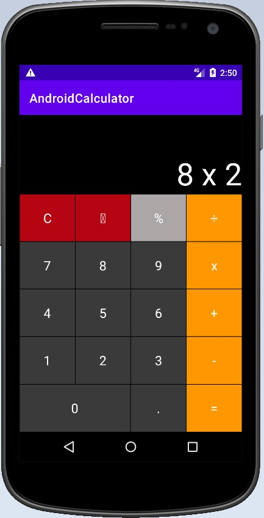
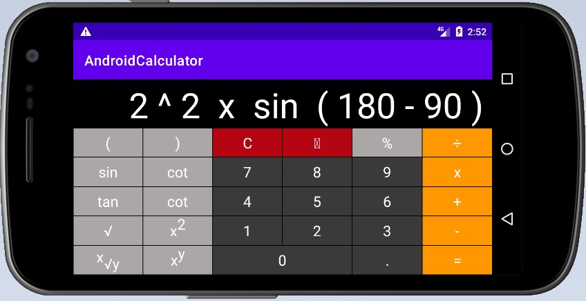

# Overview
My first project for Android. It's a remake of my Java Swing calculator project, but now it's on Android.

# Description
As "engine" this calculator uses the Reverse Polish Notation (RPN) algorithm to process entered math expression. It allows calculator to process difficult expressions instead of simple binary (two arguments) operations.

# Supported operation
Calculator supports next operations:

- Summation (+)
- Subtraction (-)
- Multiplication (x)
- Division (÷)
- Percent (%)
- Rooting (√)
- Nth rooting (x√y)
- Square (x2)
- Nth square (xy)
- Trigonometry (sin, cos, tan, cot)

# Standard and expanded views

Calculator can be used in two modes: standard and expanded.

## Standard view 

Standard view allows to calculate simple arithmetic and algebraic operations. To use this view, choose portrait smartphone orientation.

## Expanded view

Expanded view allows to calculate complex expressions with brackets and additional operations. To use this view, choose landscape smartphone orientation.

